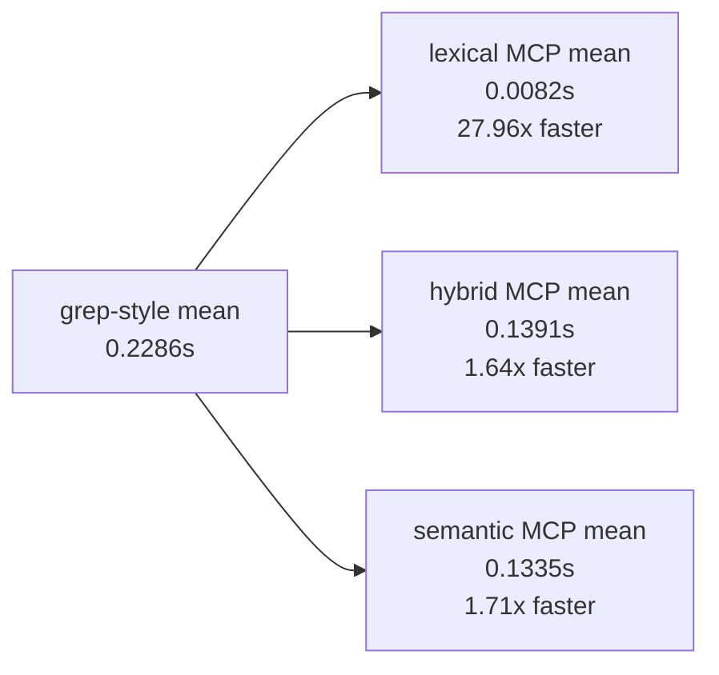

## MCP Indexed Search vs Grep-Style Scan (Fresh Runs)

This report compares fresh Rifflux MCP indexed search timings against a
grep-style full file scan over the same corpus and query set.

## Run Inputs

- Date (UTC): `2026-02-20`
- Corpus: `github/awesome-copilot` @ `84804535127a89f3f12af65f9ab0bb72094c5c4f`
- Corpus size: `919` markdown files, `9,925` chunks
- Queries (5):
  - `custom instructions`
  - `agent skills`
  - `mcp server`
  - `prompt files`
  - `vscode settings`
- Repetitions: `5` runs per query (`25` timed searches per mode)

Artifacts:

- Indexed benchmark: `.tmp/benchmarks/awesome-copilot-indexed-fresh.json`
- Grep-style benchmark: `.tmp/benchmarks/awesome-copilot-grep-fresh.json`
- Forced reindex sample: `.tmp/benchmarks/awesome-copilot-force-reindex-once.json`
- Derived summary: `.tmp/benchmarks/mcp-vs-grep-summary.json`

## Method

### Indexed side (Rifflux MCP)

- Script: `scripts/benchmark_awesome_copilot.py`
- Modes measured: `lexical`, `hybrid`, `semantic`
- `top_k=10`

### Grep-style side

- Engine: PowerShell `Select-String -SimpleMatch`
- Scope: recursive `*.md` scan over corpus path
- Pattern: phrase search per query (no semantic ranking)

## Results Summary

Baseline grep-style scan summary:

- mean: `0.228584s`
- p95: `0.307271s`

Indexed mode comparison:

| Mode | Indexed mean (s) | Grep mean (s) | Mean speedup vs grep | Indexed p95 (s) | Grep p95 (s) | p95 speedup vs grep |
|---|---:|---:|---:|---:|---:|---:|
| lexical | 0.008175 | 0.228584 | 27.96x | 0.011126 | 0.307271 | 27.62x |
| hybrid | 0.139092 | 0.228584 | 1.64x | 0.154947 | 0.307271 | 1.98x |
| semantic | 0.133504 | 0.228584 | 1.71x | 0.151794 | 0.307271 | 2.02x |

## Index Build Cost and Break-even

Measured index costs:

- Incremental reindex mean (mostly unchanged corpus): `0.343482s`
- Forced full reindex mean (single run): `6.826712s`

Break-even query counts (approximate):

$$
N \approx \frac{T_{index}}{T_{grep} - T_{indexed}}
$$

| Mode | Break-even with incremental index | Break-even with forced full reindex |
|---|---:|---:|
| lexical | 1.56 queries (~2) | 30.97 queries (~31) |
| hybrid | 3.84 queries (~4) | 76.28 queries (~77) |
| semantic | 3.61 queries (~4) | 71.80 queries (~72) |

Interpretation:

- If the index is already warm or incrementally maintained, indexed search
  amortizes quickly.
- If you include a full one-time reindex, you still break even for repeated
  workloads, especially lexical mode.

## Why MCP Indexed Search Wins on Repeated Workloads

- Query-time work is mostly DB lookup and ranking over precomputed structures.
- FTS5 avoids scanning all files for each query.
- Semantic and hybrid modes provide capabilities grep-style scans do not.
- MCP tool output includes structured metadata for downstream agent workflows.

## Caveats

- This grep-style benchmark uses `Select-String -SimpleMatch`; `rg` was not
  available in this environment.
- Result semantics differ:
  - Grep-style reports raw text matches.
  - MCP returns ranked top-k retrieval results.
- Embedding backend here is `hash-384`; semantic timings and quality may differ
  with ONNX-backed embeddings.
