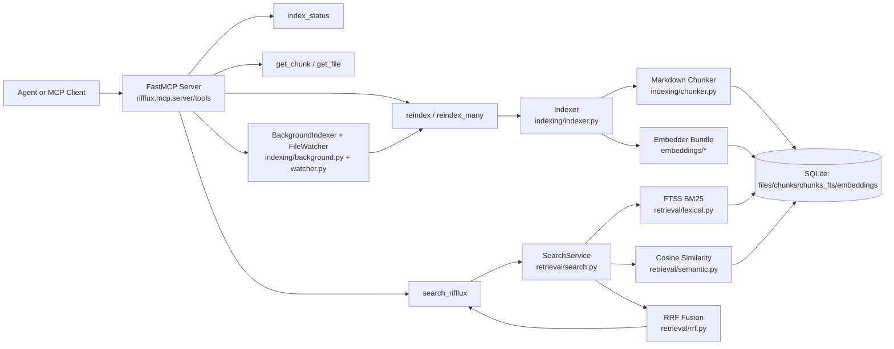
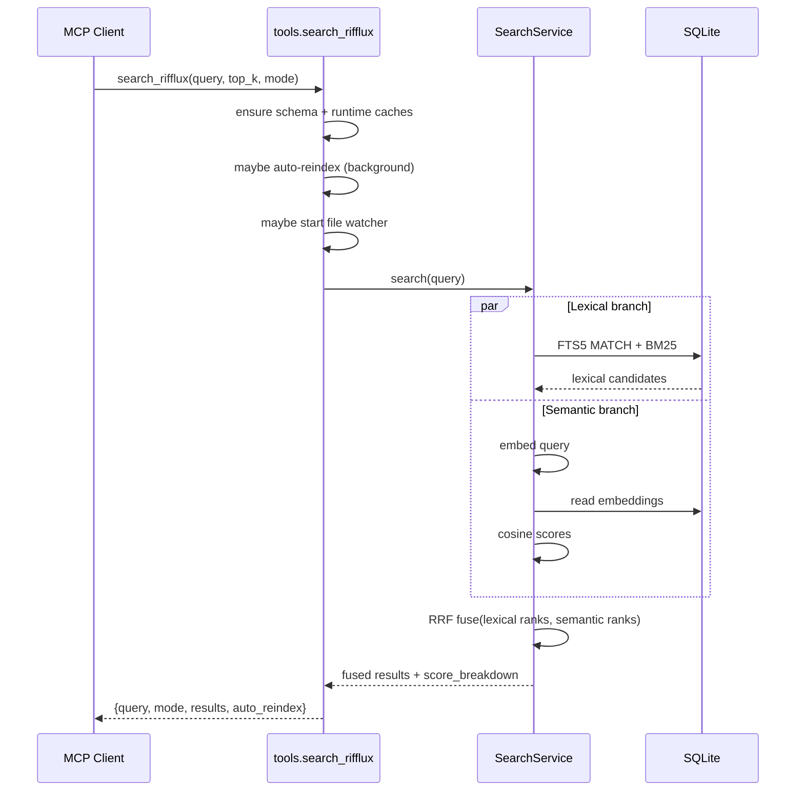
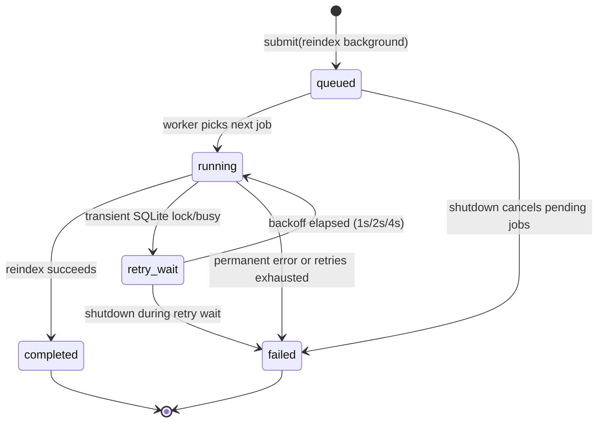
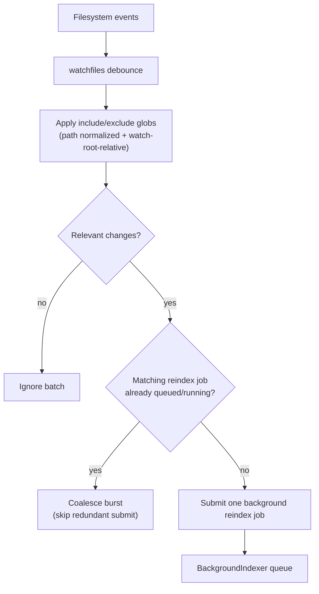
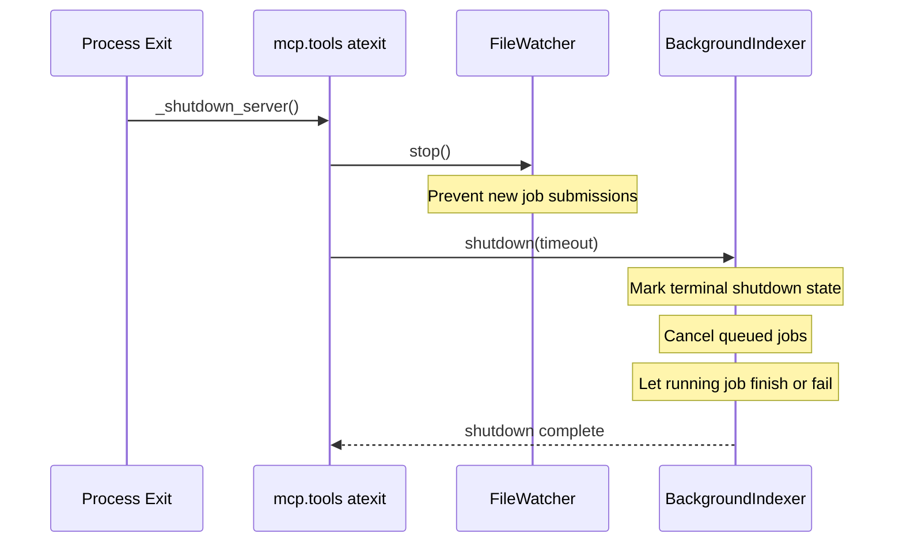

## Rifflux Architecture and Search Mechanics

This document explains how Rifflux components fit together, how indexing
works, and why MCP-backed indexed search is usually faster and more
query-capable than running `grep` repeatedly.

## Big Picture

Rifflux separates retrieval logic from MCP transport:

- Core engine: chunking, indexing, lexical search, semantic search, RRF fusion.
- MCP layer: tool contracts, request handling, auto-reindex triggers, background
  orchestration.



## Indexing Mechanism (Incremental and Deterministic)

Rifflux indexing is incremental by default and deterministic for chunk IDs.

### File-level change detection

For each candidate file under a source path:

- Apply include/exclude globs.
- Compare current `mtime_ns` + `size_bytes` with stored metadata.
- If metadata changed, compute `sha256`.
- If hash is unchanged, update metadata and skip re-chunk/re-embed.
- If hash changed (or `force=true`), re-chunk and re-embed.

This avoids unnecessary reprocessing when files are touched but content
did not change.

### Chunking rules

Markdown chunking uses AST parsing and preserves structure:

- Heading-aware section grouping (`heading_path` breadcrumbs).
- Fenced code blocks preserved as blocks.
- Chunk size bounded by `max_chunk_chars` with `min_chunk_chars` floor.
- Stable `chunk_id` from `sha256(normalized_relative_path::chunk_index)`.

### SQLite write path

- `files` stores per-file metadata.
- `chunks` stores chunk content and location metadata.
- `chunks_fts` is FTS5 external-content index on `chunks` via triggers.
- `embeddings` stores `vec` BLOB vectors per chunk.

```mermaid
flowchart TD
  Start[reindex path(s)] --> Scan[Scan files + glob filters]
  Scan --> StatCheck{"mtime+size<br/>changed?"}
  StatCheck -- no --> Skip1[Skip file]
  StatCheck -- yes --> Hash[Read bytes + sha256]
  Hash --> HashCheck{"sha256 changed?<br/>force?"}
  HashCheck -- no --> MetaOnly[Update file metadata only]
  HashCheck -- yes --> UpsertFile[Upsert files row]
  UpsertFile --> DeleteOld[Delete old chunks for file]
  DeleteOld --> Chunk[AST chunk markdown]
  Chunk --> InsertChunk[Insert chunks rows]
  InsertChunk --> Embed[Embed each chunk]
  Embed --> InsertVec[Upsert embeddings vec]
  InsertVec --> Commit[Commit transaction]
```

## Query Path (What Happens on `search_rifflux`)

`search_rifflux` initializes schema/runtime safely, optionally starts
auto-reindex or watcher behavior, then executes retrieval.

In hybrid mode:

1. Run lexical retrieval with FTS5/BM25 (`top_k * 2` candidates).
2. Embed query and run semantic cosine retrieval (`top_k * 2` candidates).
3. Fuse by Reciprocal Rank Fusion (RRF), not raw score averaging.
4. Return ranked chunks with score breakdown and metadata.



## MCP Indexed Search vs `grep`

### Why indexed search can be faster for repeated queries

`grep` behavior is generally:

- Per query: read many files from disk and scan text linearly.
- No persistent semantic index.
- Good for exact/pattern text match, especially one-off lookups.

Rifflux via MCP is generally:

- Upfront indexing cost once (or incrementally on changes).
- Query-time lookup over prebuilt FTS and embedding tables.
- Reuses cached DB structures across many queries.
- Supports semantic ranking and hybrid fusion.

For many queries over mostly stable content, amortized cost tends to favor
indexed retrieval.

### Capability comparison

| Dimension | `grep` | Rifflux MCP search |
|---|---|---|
| Exact term lookup | Strong | Strong (FTS lexical mode) |
| Semantic similarity | No | Yes (semantic mode) |
| Hybrid lexical + semantic | No | Yes (RRF fusion) |
| Structured metadata (`path`, heading, chunk index) | Limited/manual | Native in results |
| Incremental update support | N/A | Yes (mtime/size/hash pipeline) |
| Background refresh | No | Yes (auto-reindex + watcher) |

### Practical rule of thumb

- Use `grep` for fast ad-hoc literal regex checks.
- Use Rifflux MCP tools for repeated exploration, ranking quality,
  and semantic/hybrid retrieval.

## Background Indexing and Watcher Resilience

Rifflux includes operational mechanisms that help search stay fresh without
blocking interactive calls:

- `BackgroundIndexer` runs queued reindex jobs sequentially.
- Transient SQLite lock/busy errors retry up to 3 times with exponential backoff.
- `FileWatcher` can auto-submit reindex jobs on relevant file changes.
- Watcher auto-restarts on transient crashes (up to configured cap).
- `index_status` reports job and watcher state.

### Background job lifecycle



### File watcher event path



### Shutdown sequence



## Embedding Backend Decision (Pros/Cons)

Rifflux uses ONNX as the primary semantic path, with `auto` runtime default
(`onnx` first, deterministic `hash` fallback) to keep environments resilient.

For full rationale, alternatives considered, and explicit pros/cons
comparisons, see `docs/embedding-backend-decision.md`.

## Where to Look in Code

- MCP tools and orchestration: `src/rifflux/mcp/tools.py`
- Indexing pipeline: `src/rifflux/indexing/indexer.py`
- Markdown chunking: `src/rifflux/indexing/chunker.py`
- Background queue and retry: `src/rifflux/indexing/background.py`
- File watcher: `src/rifflux/indexing/watcher.py`
- Search orchestration: `src/rifflux/retrieval/search.py`
- SQLite operations: `src/rifflux/db/sqlite_store.py`
- Schema (tables, FTS, triggers): `src/rifflux/db/schema.sql`
